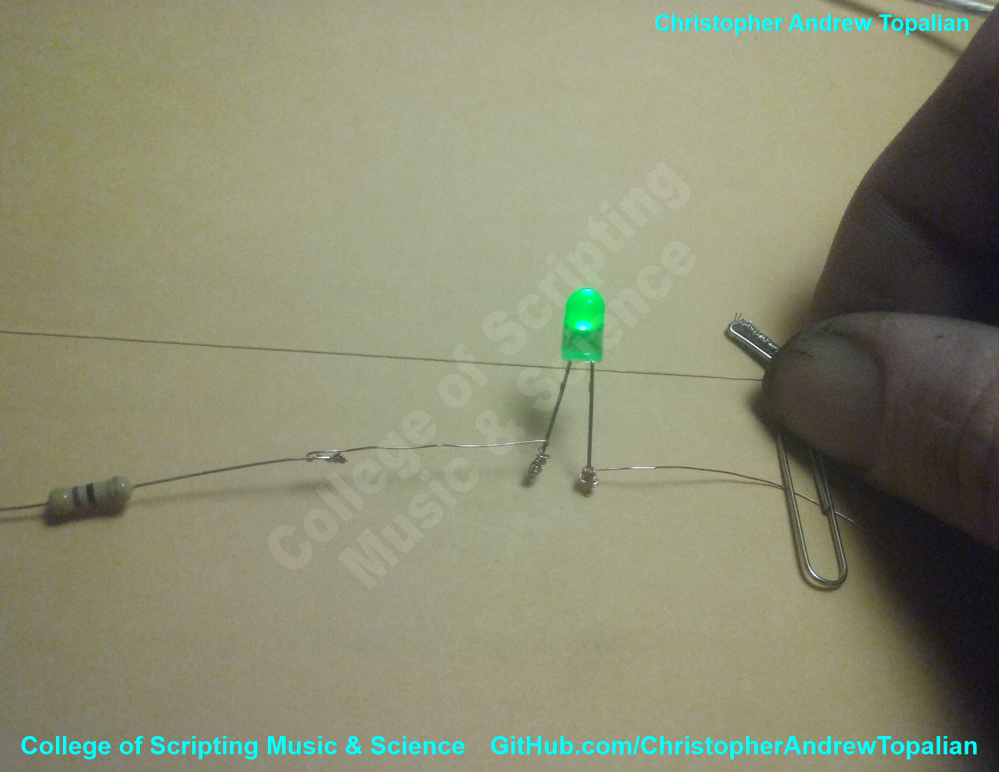
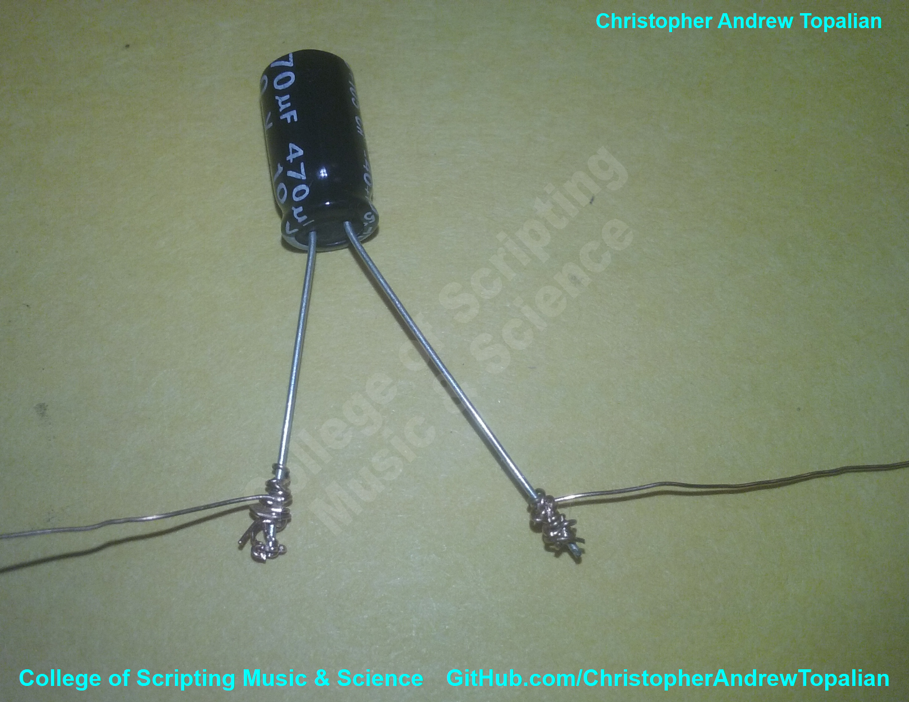

# CATopalian Thin Wiretronics
A fun and efficient and inexpensive way to make Electronic circuits using thin wire, such as speaker wire strands, by Christopher Andrew Topalian.

Dedicated to God the Father

---

Video: https://www.youtube.com/watch?v=5rzEsbzR8qM

---

[Light Detector Circuit CATopalian Thin Wiretronics Press Release](src/2025_10_02/light_detector_circuit_catopalian_thin_wiretronics_press_release.md)

Video: https://www.youtube.com/watch?v=dgLxeJavxxo

---

How to Download this Tutorial
1. Click the green Code Button on this github page
2. Choose Download ZIP
3. Save the Zip File
4. Extract All
5. Double click the README.md file to open it in VSCode

---

//----//

// Dedicated to God the Father  
// All Rights Reserved Christopher Andrew Topalian Copyright 2000-2025  
// https://github.com/ChristopherTopalian  
// https://github.com/ChristopherAndrewTopalian  
// https://sites.google.com/view/CollegeOfScripting

