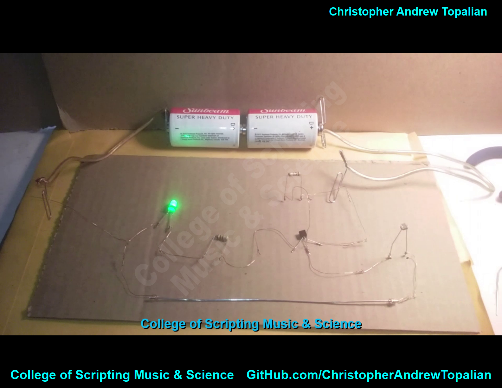
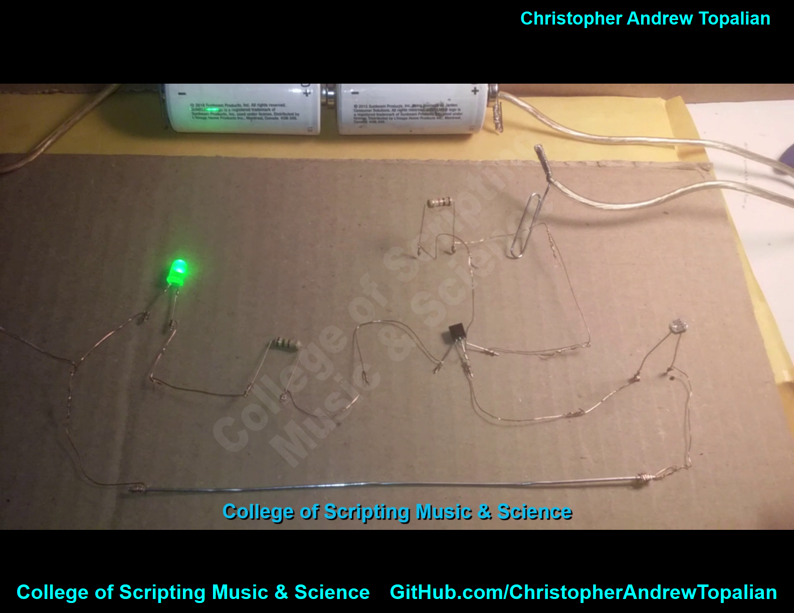

// light_detector_circuit_catopalian_thin_wiretronics_press_release.md

VIDEO: https://www.youtube.com/watch?v=dgLxeJavxxo

---

---

In this video, we build a light detector circuit using the CATopalian Thin Wiretronics twist tie method. This circuit uses ultra-thin strands of speaker wire to connect the components together, creating a unique and minimal wiring style.

The circuit uses a PNP 3906 transistor, a 1k resistor and an LDR on the base, with the collector tied to the positive rail. The emitter is connected to a 150 ohm resistor and a green LED. Powered by two D batteries (~3V), the LED lights up when light is detected and turns off in the dark.

We use the twist tie method with fragile copper strands from speaker wire. Two important tips:

Don’t twist too tight, or the wire will snap.

Don’t crimp the wire if possible because the wire is fragile and will likely break from crimping.

But if you do crimp it at all, use gentle force with smooth needle nose pliers. To say again though, better to wrap it tight and good than to break the wire with a hard crimp.

For the power connection, we use paperclips and neodymium magnets to wedge the thin wire securely against the battery terminals, ensuring a strong connection without soldering.

This project shows how you can make working circuits with almost no tools, just patience, care, and creativity. Perfect for educational purposes, hobbyists, or anyone interested in experimenting with minimal electronics.

CATopalian Thin Wiretronics shows that even fragile wire can be a powerful teaching tool for circuit building.

---

//----//

// Dedicated to God the Father  
// All Rights Reserved Christopher Andrew Topalian Copyright 2000-2025  
// https://github.com/ChristopherTopalian  
// https://github.com/ChristopherAndrewTopalian  
// https://sites.google.com/view/CollegeOfScripting

